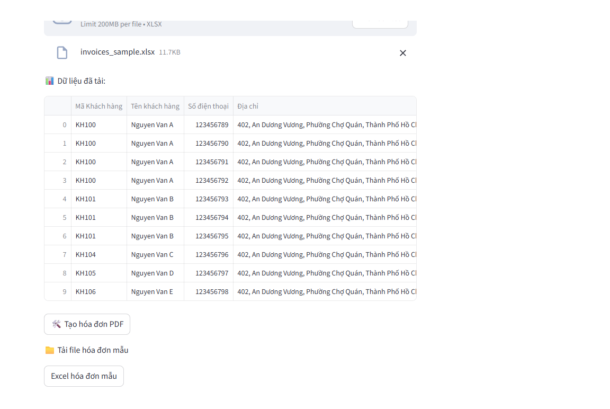
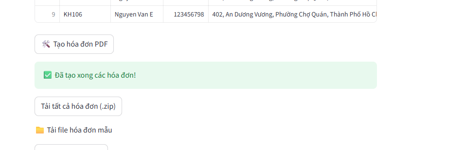

# 📖 Hướng dẫn sử dụng: INVOICE APP

## 🎯 Mục đích

Ứng dụng hỗ trợ **tạo hóa đơn PDF** tự động từ file Excel có sẵn.

---

## ⚙️ Cài đặt & Sử dụng

### 🔑 Yêu cầu tiên quyết

* Python **3.x.x**
* PIP

### 🛠 Cài đặt

1. Khởi tạo môi trường ảo Python và kích hoạt.
2. Tải mã nguồn về máy.
3. Di chuyển vào thư mục dự án.
4. Cài đặt thư viện:

   ```bash
   pip install -r requirements.txt
   ```
5. Chạy ứng dụng Streamlit:

   ```bash
   streamlit run app.py
   ```

### 🚀 Sử dụng

* Truy cập trình duyệt tại: **`http://localhost:8501`**
* Giao diện chính:


* Người dùng có thể bấm nút **`Excel hóa đơn mẫu`** để tải file Excel mẫu.
* Hoặc, nếu đã có file Excel dữ liệu → tải trực tiếp lên.



* Sau khi tải file, bấm **`Tạo hóa đơn PDF`** → ứng dụng sẽ tạo thư mục chứa các hóa đơn PDF (mỗi khách hàng/đơn hàng trong một ngày).



* Cuối cùng, bấm **`Tải tất cả hóa đơn`** để tải về file **.zip** chứa toàn bộ hóa đơn.
* Hóa đơn mẫu sẽ như sau:


---

# 📖 User Guide: INVOICE APP

## 🎯 Purpose

This app helps you **generate PDF invoices** automatically from an existing Excel file.

---

## ⚙️ Installation & Usage

### 🔑 Prerequisites

* Python **3.x.x**
* PIP

### 🛠 Installation

1. Create and activate a Python virtual environment.
2. Download the source code.
3. Navigate to the project folder.
4. Install required dependencies:

   ```bash
   pip install -r requirements.txt
   ```
5. Run the Streamlit application:

   ```bash
   streamlit run app.py
   ```

### 🚀 How to Use

* Open your browser and go to: **`http://localhost:8501`**
* Main interface:


* Click **`Download Sample Excel`** to get a template file.
* Or upload your own Excel file with invoice data.


* After uploading, click **`Generate PDF Invoices`** → the app will create a folder containing invoices (one per customer/order per day).


* Finally, click **`Download All Invoices`** to download a **.zip** file with all invoices.
* Example of a generated invoice:


---

