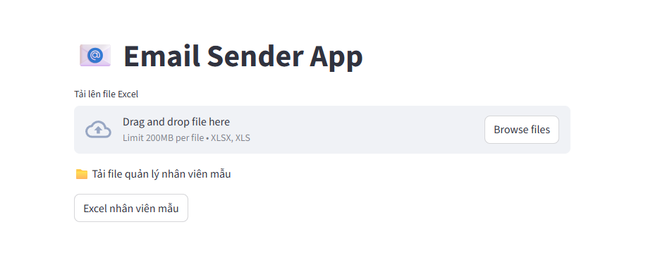
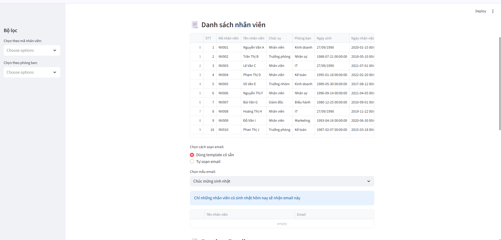
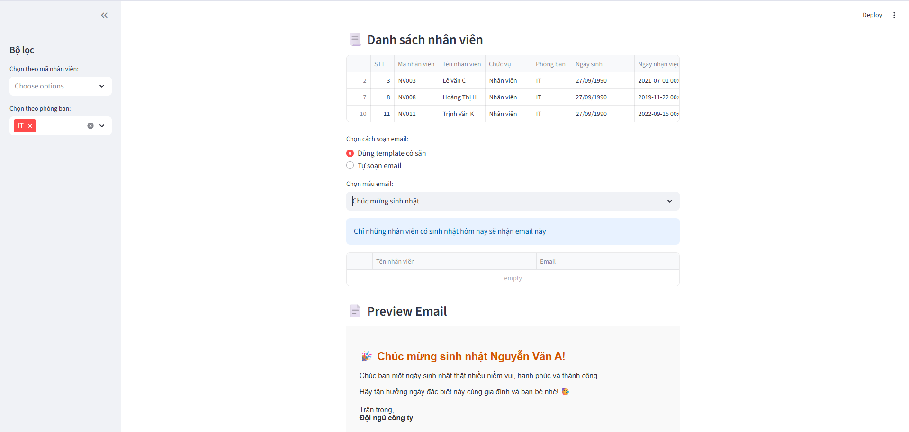
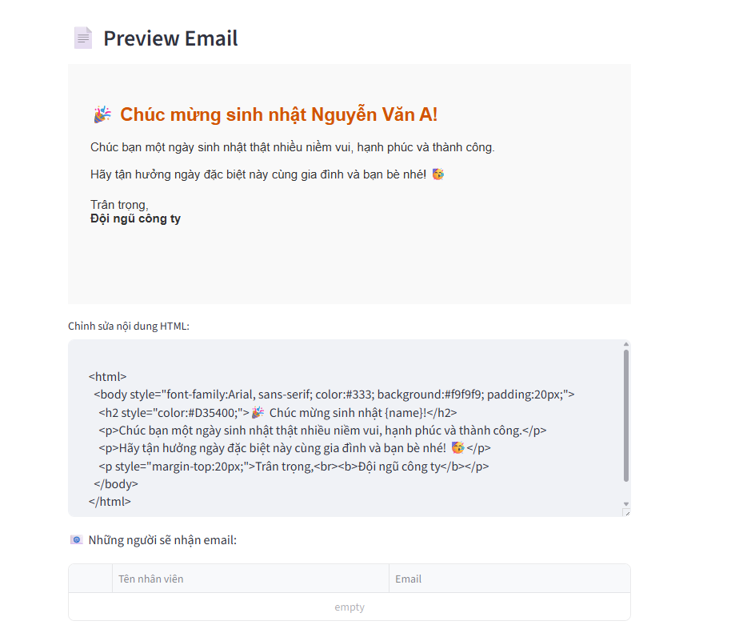

# 📖 Hướng dẫn sử dụng: Email Sender App

## 🎯 Mục đích

* Ứng dụng giúp gửi **email hàng loạt** đến toàn bộ hoặc chỉ định một nhóm nhân viên trong công ty.
* Chức năng chính: gửi email **chúc mừng sinh nhật**.
* Ngoài ra, ứng dụng hỗ trợ nhiều loại email khác như:

  * Mời họp
  * Mời tham dự sự kiện
  * Soạn thảo nhanh một email bất kỳ
* Ưu điểm so với việc gửi email thủ công:

  * Gửi email **tự động**
  * Không cần nhớ địa chỉ email từng nhân viên, tránh nhầm lẫn khi CC/BCC
  * **Dễ dàng chọn lọc** người nhận theo mã nhân viên hoặc phòng ban

---

## ⚙️ Cài đặt & Sử dụng

### 🔑 Yêu cầu tiên quyết

* Python **3.x.x**
* PIP

### 🛠 Cài đặt

1. Khởi tạo môi trường ảo Python và kích hoạt.
2. Tải mã nguồn về máy.
3. Di chuyển vào thư mục dự án.
4. Cài đặt thư viện:

   ```bash
   pip install -r requirements.txt
   ```
5. Chạy ứng dụng Streamlit:

   ```bash
   streamlit run app.py
   ```

---

### 🚀 Sử dụng

* Mở trình duyệt và truy cập: **`http://localhost:8501`**



* Nhấn nút **`Excel nhân viên mẫu`** để tải file quản lý nhân viên mẫu.
* Hoặc tải file Excel nhân viên sẵn có để bắt đầu sử dụng.



* Sau khi tải file, ứng dụng sẽ đọc dữ liệu và hiển thị danh sách nhân viên.
* Bên trái màn hình có **bộ lọc tùy chỉnh**, cho phép chọn người nhận email theo:

  * Mã nhân viên
  * Phòng ban
    (Có thể chọn nhiều tiêu chí cùng lúc)



* Sau khi lọc, danh sách nhân viên được chọn sẽ hiển thị.
* Những người này chính là **người nhận email**, hiển thị trong mục **Preview Email**.



* Trong **Preview Email**:

  * Người dùng có thể xem trước nội dung email.
  * Có thể chỉnh sửa nội dung cho phù hợp.
  * Bên dưới là danh sách người nhận (tên và địa chỉ email).

---

# 📖 User Guide: Email Sender App

## 🎯 Purpose

* This app allows sending **bulk emails** to all employees or selected groups within a company.
* Main feature: sending **birthday greetings** automatically.
* Additional features include sending emails for:

  * Meeting invitations
  * Event invitations
  * Quick custom emails
* Advantages over traditional email sending:

  * **Automated** sending
  * No need to remember or manually check each employee's email
  * **Easy filtering** of recipients by employee ID or department

---

## ⚙️ Installation & Usage

### 🔑 Prerequisites

* Python **3.x.x**
* PIP

### 🛠 Installation

1. Create and activate a Python virtual environment.
2. Download the source code.
3. Navigate to the project folder.
4. Install dependencies:

   ```bash
   pip install -r requirements.txt
   ```
5. Run the Streamlit app:

   ```bash
   streamlit run app.py
   ```

---

### 🚀 How to Use

* Open browser and go to: **`http://localhost:8501`**


* Click **`Download Sample Employee Excel`** to get a sample employee management file.
* Or upload your own employee Excel file.


* Once uploaded, the app will read the file and display employee data.
* On the left panel, use the **filter options** to select recipients by:

  * Employee ID
  * Department
    (Multiple selections supported)


* After filtering, selected employees will be shown.
* These recipients will appear in the **Preview Email** section.


* In **Preview Email**:

  * You can preview the email content before sending.
  * Edit the message if needed.
  * See the recipient list (with names and email addresses).

---

